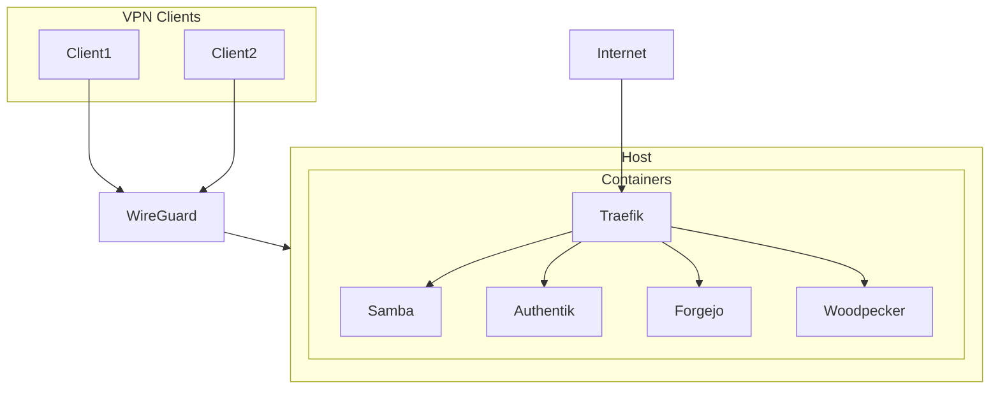

# Architecture

This document describes the architecture of the mkb-stack.

## Overview

The mkb-stack is designed to run on a single host machine. It uses [Incus](https://linuxcontainers.org/incus/) to create a set of containers, each running a specific service. This container-based approach provides isolation between the services and makes the stack more secure and easier to manage.

[Ansible](https://www.ansible.com/) is used to automate the configuration of the host and the containers. The configuration is defined in a set of Ansible playbooks and roles, which are included in this repository.

## Network

All containers are connected to a private network. A [Traefik](https://traefik.io/traefik/) container is used as a reverse proxy to expose the services to the outside world. Traefik is configured to use [Let's Encrypt](https://letsencrypt.org/) to automatically obtain SSL certificates for the services.

[WireGuard](https://www.wireguard.com/) is used to provide a secure VPN connection to the host and the private network.

## Services

The following services are included in the mkb-stack:

*   **Samba:** Provides file sharing services and acts as an Active Directory domain controller.
*   **Authentik:** An identity provider that provides single sign-on (SSO) for the other services.
*   **Forgejo:** A self-hosted Git service.
*   **Woodpecker:** A CI/CD service that integrates with Forgejo.
*   **Traefik:** A reverse proxy that exposes the services to the outside world.

## Diagram

